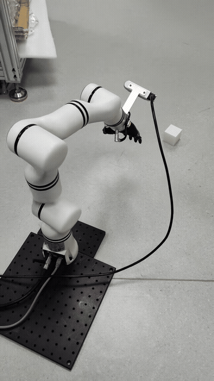
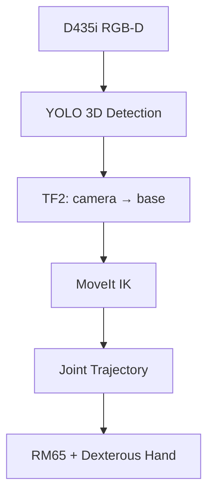

<div align="center">

# RM65 Vision Grasping

### 🤖让机械臂“看见、算清、再动手” 🤖

基于 **RealMan RM65-6F + LiteS001 灵巧手 + RealSense D435i** 的 ROS 2 视觉抓取系统

[](https://docs.ros.org/en/humble/)
[](https://moveit.picknik.ai/)
[](https://www.python.org/)
[](https://ubuntu.com/)

</div>



> [▶ 点击观看完整 30 秒演示视频](media/grasping_demo.mp4)

## 这个项目做了什么？

我搭建了一条从 RGB-D 感知到机械臂执行的完整链路：YOLO 给出物体三维位置，TF2 将目标从相机坐标系转换到机械臂基坐标系，MoveIt 2 求解逆运动学，最后通过关节轨迹控制器执行“靠近—下降—抓取—抬升”。

它不只是把几个 ROS 节点拼起来。项目中真正费脑筋的，是让 **URDF、TF、MoveIt、控制器和真实硬件使用同一套坐标与关节语义**。这也是本仓库最想展示的部分。

## 系统链路



| 层级 | 输入 → 输出 | 我的工作 |
|---|---|---|
| 感知 | RGB-D → 物体三维中心 | 接入 YOLO 3D 检测话题并筛选目标 |
| 坐标变换 | 相机坐标 → 基座坐标 | 完成 Eye-in-Hand 标定并维护 TF 链 |
| 运动学 | 目标位姿 → 6 关节角 | 配置 KDL IK、TCP、规划组与碰撞模型 |
| 执行 | 关节角 → 真实运动 | 对接 `FollowJointTrajectory`，增加状态门禁和超时 |
| 工程可靠性 | 异步消息 → 稳定抓取流程 | 多线程执行、重复目标过滤、QoS 对齐、错误码诊断 |

## 我对机器人学知识的实际应用

### 1. 运动学：抓取目标必须落在正确坐标系里

相机测到的点不能直接送给机械臂。目标点需要经过手眼外参和机械臂当前位姿变换：

$$
{}^{B}\mathbf{p}_{O} = {}^{B}\mathbf{T}_{E}\;{}^{E}\mathbf{T}_{C}\;{}^{C}\mathbf{p}_{O}
$$

其中 B、E、C、O 分别代表基座、末端、相机和目标。代码实现位于 [`vision_tf_node.py`](src/custom_grasp_pke/custom_grasp_pke/vision_tf_node.py)。

### 2. 逆运动学：从“物体在哪里”到“六个关节转多少”

我使用 MoveIt `/compute_ik` 将 `tcp_link` 的目标位姿转换为关节角，并用当前 `/joint_states` 作为初值。这样既能提高求解连续性，也能在机械臂状态尚未就绪时阻止危险请求。

### 3. 动力学意识：规划不是“能到就行”

URDF 中的质量、质心和惯量决定机器人动力学模型；关节速度限制、轨迹时长和控制器容差决定真实执行是否平稳。本项目没有自称实现自研逆动力学控制器，而是把重点放在 **模型一致性、速度约束和轨迹执行可靠性** 上。更完整的推导与设计取舍见 [机器人学笔记](docs/robotics_notes.md)。

## 排错经验

| 现象 | 根因 | 最终解决方法 |
|---|---|---|
| RViz 有模型，但 `move_group` 没有机器人 | `robot_description` 未正确传给 MoveIt | 用 `MoveItConfigsBuilder` 显式加载合并 URDF 与 SRDF |
| 报 `Unable to parse robot_description as yaml` | Launch 把字符串误当 YAML 参数解析 | 用 `ParameterValue(..., value_type=str)` 固定参数类型 |
| 检测正常，机械臂却不动 | 控制链未就绪、关节名/Action 名或 QoS 不一致 | 增加 `/joint_states` 门禁、服务/Action 检查和错误码日志 |
| 订阅回调后节点像“卡死” | 在回调或构造函数中同步等待服务 | `MultiThreadedExecutor` + 后台抓取线程 + 超时机制 |
| 末端能到，手指却对不准目标 | IK 使用法兰 `Link6`，没有表达真实抓取点 | 为手掌定义 `tcp_link`，SRDF 规划链延伸到 TCP |

完整复盘见 [问题解决记录](docs/problem_solving.md)。

## 代码导航

```text
rm65_vision_grasping/
├── src/custom_grasp_pke/          # 我编写的视觉转换与抓取控制节点
├── config/
│   ├── hand_eye_calibration.yaml  # Eye-in-Hand 外参快照
│   ├── moveit/                    # SRDF、IK 与运动限制关键配置
│   └── robot_model/               # RM65—灵巧手—TCP 连接片段
├── docs/                          # 机器人学设计与排错复盘
├── scripts/doctor.sh              # ROS 图快速诊断脚本
└── media/                         # 演示视频与预览
```

建议面试时先看：

1. [`vision_tf_node.py`](src/custom_grasp_pke/custom_grasp_pke/vision_tf_node.py)：坐标变换链路；
2. [`grasp_control_node.py`](src/custom_grasp_pke/custom_grasp_pke/grasp_control_node.py)：IK、轨迹执行和并发设计；
3. [`real_moveit_demo_6f.launch.py`](config/moveit/real_moveit_demo_6f.launch.py)：合并模型如何正确进入 MoveIt；
4. [`problem_solving.md`](docs/problem_solving.md)：我如何定位问题，而不只是反复试命令。

## 环境与运行

验证环境：Ubuntu 22.04、ROS 2 Humble、MoveIt 2、Python 3.10。

第三方依赖没有重复打包进本仓库，请先按 [THIRD_PARTY.md](THIRD_PARTY.md) 安装 RealMan 驱动、`yolo_ros`、RealSense ROS 和灵巧手模型。将本仓库的 ROS 2 包链接到工作空间后：

```bash
mkdir -p ~/grasping_ws/src
ln -s "$(pwd)/src/custom_grasp_pke" ~/grasping_ws/src/custom_grasp_pke
cd ~/grasping_ws
colcon build --symlink-install
source install/setup.bash
ros2 launch custom_grasp_pke vision_grasp.launch.py
```

真实机械臂 IP 与 UDP 回传地址由上游 `rm_driver/config/rm_65_config.yaml` 管理；连接前请按现场网络修改 `arm_ip` 和 `udp_ip`，不要把个人网络配置提交到仓库。

运行前建议先执行：

```bash
bash scripts/doctor.sh
```

> 安全提示：首次连接真实机械臂时，请降低速度、清空工作空间并保持急停可用。仓库中的标定外参只对应本项目装配，不能直接用于另一套硬件。

## 当前边界与下一步

- ✅ 已完成：3D 检测接入、手眼变换、RM65 IK、关节轨迹执行、完整启动编排；
- 🟡 工程边界：公开代码中的灵巧手开合保留为接口占位，演示重点是视觉到机械臂运动链路；
- 🔜 下一步：接入真实手部驱动、加入抓取姿态估计、轨迹时间参数化与力/触觉闭环。

---

<div align="center">

如果你正在看这个仓库：欢迎从 Issue 开始聊机器人、视觉抓取或 ROS 2。🙂

</div>
